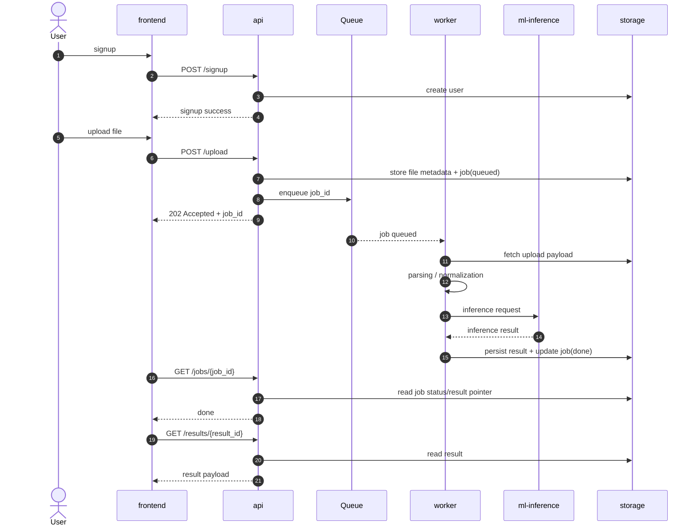

# MVP B2C Architecture (v0)

## Цель документа
Зафиксировать минимально жизнеспособную B2C-архитектуру продукта, разделённую на независимые контуры, с явными контрактами входов/выходов и границами ответственности.

---

## 1) Контур `frontend`

**Ответственность**
- Отображение UI/UX (web/mobile) для регистрации, загрузки данных, просмотра статуса обработки и результатов.
- Сбор пользовательского ввода, валидация на уровне клиента, отображение прогресса и ошибок.
- Работа только через публичные API-контракты.

**Вход**
- Действия пользователя: `signup`, `login`, `upload`, `open result`.
- Ответы API: токены, статусы job, итоговые данные.

**Выход**
- HTTP(S)-запросы в `api` (auth, upload, polling статуса, получение результата).
- Клиентские события аналитики (опционально в v0).

**Явные ограничения**
- Frontend не содержит бизнес-логики парсинга/инференса.
- Frontend не взаимодействует напрямую с очередями, воркерами и ML-сервисами.

---

## 2) Контур `api`

**Ответственность**
- Аутентификация/авторизация, управление сессией и пользователем.
- Оркестрация потока обработки: принять upload, создать job, отдать статус, вернуть результат.
- Валидация метаданных, маршрутизация запросов к нужным внутренним компонентам.

**Вход**
- HTTP(S)-запросы от `frontend`:
  - `POST /signup`
  - `POST /upload`
  - `GET /jobs/{id}`
  - `GET /results/{id}`

**Выход**
- Запись метаданных и статусов в `storage`.
- Публикация задач в очередь для `worker`.
- Чтение агрегированного результата из `storage`.

**Явные ограничения**
- **API не делает OCR/ML синхронно** и не выполняет тяжёлые вычисления в request/response.
- API не парсит документы в полном объёме, а только оркестрирует жизненный цикл job.

---

## 3) Контур `worker`

**Ответственность**
- Асинхронная обработка задач из очереди.
- ETL-пайплайн: извлечение файла/данных, нормализация, вызов парсинга, вызов inference.
- Обновление статуса (`queued` -> `processing` -> `done|failed`) и ретраи.

**Вход**
- Сообщения очереди job от `api`.
- Данные файла/объекта из `storage`.

**Выход**
- Вызовы в `ml-inference`.
- Запись промежуточных и финальных статусов/результатов в `storage`.
- Технические логи/метрики в `observability`.

**Явные ограничения**
- Worker не обслуживает внешние HTTP-запросы пользователей.
- Worker не хранит состояние как источник истины (state-of-record только в `storage`).

---

## 4) Контур `ml-inference`

**Ответственность**
- Выполнение ML/правил инференса на уже подготовленных входных данных.
- Версионирование моделей, контроль совместимости схемы признаков.
- Возврат предсказаний + confidence/diagnostics (если применимо).

**Вход**
- Запросы от `worker` с подготовленными признаками/структурированным payload.

**Выход**
- Предсказания, объяснимые поля (если доступны), коды ошибок модели.
- Сервисные метрики latency/error-rate в `observability`.

**Явные ограничения**
- `ml-inference` не занимается оркестрацией пользовательских job.
- Не управляет жизненным циклом аккаунтов, файлами пользователя и правами доступа.

---

## 5) Контур `storage`

**Ответственность**
- Единый слой хранения:
  - объекты загрузок (blob/object storage),
  - транзакционные сущности (users/jobs/results),
  - опционально кэш/индексы чтения.
- Обеспечение целостности, идемпотентности записи и аудита изменений.

**Вход**
- CRUD-операции от `api` и `worker`.

**Выход**
- Данные/статусы для чтения в `api`.
- Источник фактов для аналитики и восстановления обработки.

**Явные ограничения**
- Storage не содержит бизнес-оркестрацию и не исполняет доменную логику.

---

## 6) Контур `observability`

**Ответственность**
- Централизованные логи, метрики, трассировки и алерты.
- SLI/SLO по доступности API и времени обработки job.
- Диагностика инцидентов и деградации качества пайплайна.

**Вход**
- Логи/метрики/трейсы от `api`, `worker`, `ml-inference`.

**Выход**
- Дашборды, алерты в on-call канал, отчёты по error budget.

**Явные ограничения**
- Observability не подменяет бизнес-хранилище и не является источником продуктовых данных.

---

## Последовательность: `signup -> upload -> job queued -> parsing -> inference -> persist -> result`

---

## Обязательное для релиза v0 vs отложенное

### Обязательное для v0 (MUST)
1. `frontend`
   - Signup/login, upload, экран статуса job, экран результата.
2. `api`
   - Эндпойнты: signup/auth, upload, status, result.
   - Оркестрация очереди без синхронного OCR/ML в HTTP-запросе.
3. `worker`
   - Очередь + обработка job + retry policy (минимум 1-2 ретрая).
4. `ml-inference`
   - Базовый inference endpoint c фиксированной версией модели.
5. `storage`
   - Хранение users/jobs/results + загруженных файлов.
6. `observability`
   - Базовые метрики (RPS, latency, errors), корреляция job_id в логах.

### Отложено после v0 (SHOULD LATER)
1. OCR v2 (улучшенное качество распознавания, layout-aware parser).
2. Push-уведомления о завершении job (web push/mobile push/email).
3. Real-time обновления статуса через WebSocket/SSE (вместо polling).
4. Продвинутые explainability-артефакты модели и персональные рекомендации.
5. Авто-масштабирование с predictive policies и multi-region failover.
6. Расширенный FinOps/observability (cost-per-job, детальный tracing sampling control).

---

## Критерии архитектурной корректности
- API остаётся тонким orchestration-слоем; тяжёлая обработка вынесена в async контуры.
- Любой долгий шаг (parsing/inference) выполняется вне request/response path.
- Статус job воспроизводим из `storage`; frontend не зависит от внутренней топологии сервисов.
- Каждая граница контура имеет минимальный явный контракт вход/выход.
